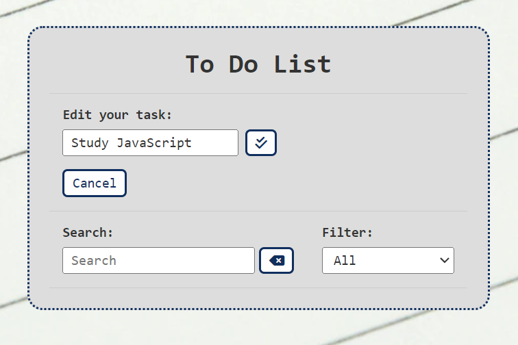
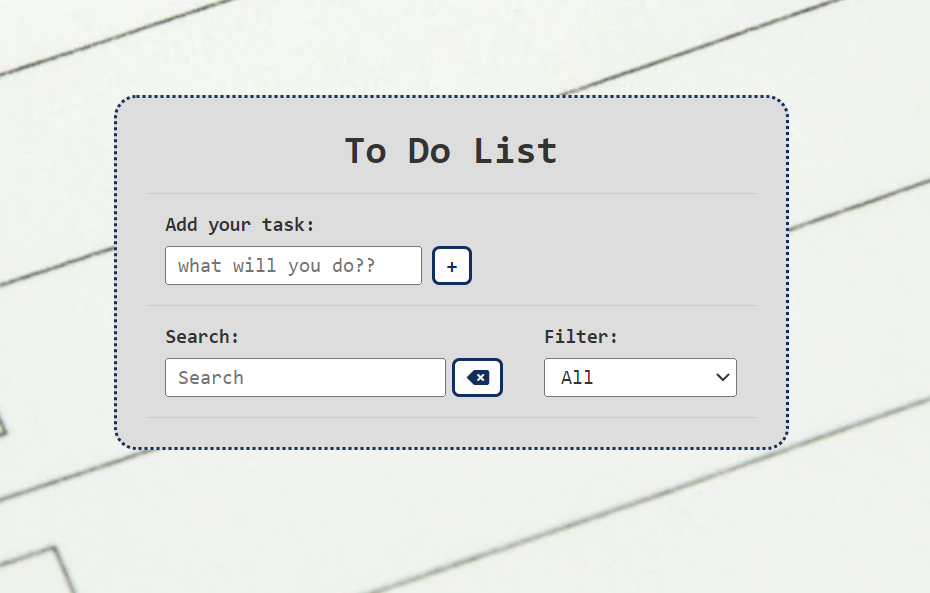
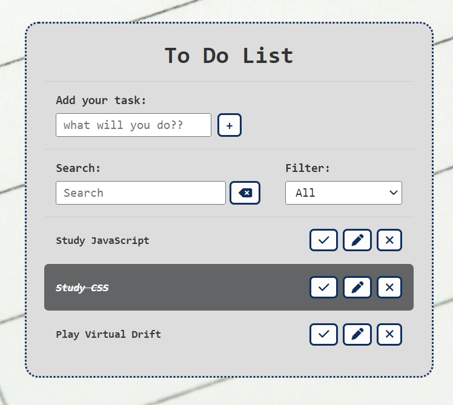

# ToDoList-JS

<i>Project developed using only HTML5, CSS3 and advanced JavaScript.</i>

You can check out other projects I've developed here on my GitHub, or contact me through the other links.
 

